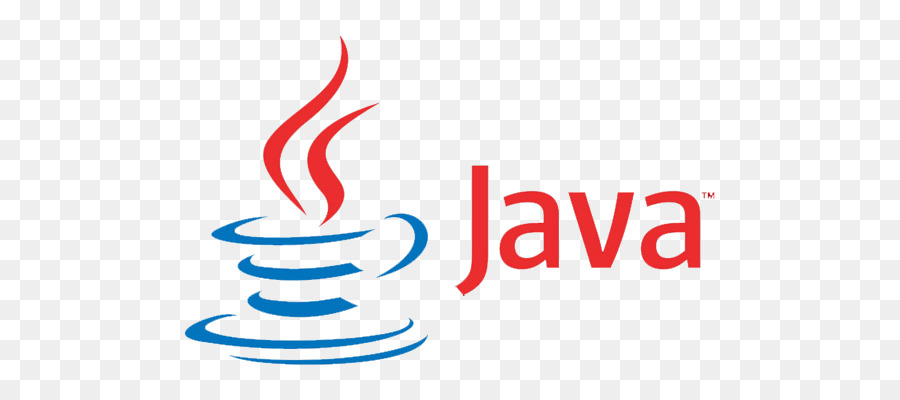

## Hi there 👋
<!-- ### I am a web programmer -->
<!--  -->


<!-- I am Cheikh Oumar Ba from Senegal, an engeneering student at Dakar's Polytechnic Higher School -->

I am **Cheikh Oumar Ba** from Senegal🇸🇳 and I am a young man curious, dynamic and above all passionate about everything related to new technologies.

I am an engeneering student at Dakar's Polytechnic Higher School. I am comfortable in some programming languages like java and C langage, I also do a little bit of angular, typescript, spring boot, bash and flutter for mobile development. I am also very organized by nature and love to write and read as well.

- 🔭 I’m currently working on web scraping project. 
- 🌱 I’m currently learning Flutter 
- 😄 Pronouns: he/him
- ⚡ Fun fact: Multimedia | Mangas | Sport | Programmation | Poem

<!-- >>> Skills: JAVA / C / SPRING BOOT / JavaEE / Javascript / ANGULAR / HTML / CSS / Materialize / Bootstrap / TailwindCss / UML / Canva / Mysql -->

|Langage de programmation|Back-end|   Front-end                    |     Modelisation & design |   Infrastruture & DB    |       Tools            |
|---------|:--------------------|:--------------------------------:|--------------:|:------------------------------------|:-----------------------|
|  C      |    Spring Boot      |       Javascript/Typescript      |     UML       |     MySql                           |         Intelij        |
| Java    |    Nest Js          |       Angular                    |     FIGMA     |     MongoDb                         |         Vs Code        |
| Python  |   Java EE           |       HTML/CSS                   |     CANVA     |     Docker                          |         Postman        |
|         |                     |Bootstrap/Materialize/TailwindCss |Visual paradigm|     Jenkins                         |         Github         | 
|         |                     |                                  |               |     Linus                           |         VIM            |  

<!-- [](https://github.com/anuraghazra/github-readme-stats) -->

```text
Spring Boot  4 hrs 22 mins   ███████████░░░░░░░░░░░░░░   29.28 %
Nest Js      1 hrs 13 mins   ████████▓░░░░░░░░░░░░░░░░   26.07 %
Angular      1 hr 07 mins    ██████▓░░░░░░░░░░░░░░░░░░   23.92 %
CSS          1 hr            ████▓░░░░░░░░░░░░░░░░░░░░   21.42 %
HTML         36 mins         ██▓░░░░░░░░░░░░░░░░░░░░░░   12.85 %
Git Config   12 mins         ░░░░░░░░░░░░░░░░░░░░░░░░░   00.42 %
Linux Config 09 mins         ░░░░░░░░░░░░░░░░░░░░░░░░░   00.32 %
```

  


[](https://github.com/Cheikh785)


<!--
<h3 align="left">Languages and Tools:</h3>
<p align="left"> 



<a href="https://www.w3schools.com/css/" target="_blank" rel="noreferrer">  </a> <a href="https://www.figma.com/" target="_blank" rel="noreferrer">  </a> <a href="https://git-scm.com/" target="_blank" rel="noreferrer">  </a> <a href="https://www.w3.org/html/" target="_blank" rel="noreferrer">  </a> <a href="https://developer.mozilla.org/en-US/docs/Web/JavaScript" target="_blank" rel="noreferrer">  </a> <a href="https://sass-lang.com" target="_blank" rel="noreferrer">  </a> <a href="https://svelte.dev" target="_blank" rel="noreferrer">  </a> <a href="https://www.typescriptlang.org/" target="_blank" rel="noreferrer">  </a> <a href="https://vuejs.org/" target="_blank" rel="noreferrer">  </a> <a href="https://reactjs.org/" target="_blank" rel="noreferrer">  </a> <a href="https://firebase.google.com/" target="_blank" rel="noreferrer">  </a> <a href="https://flutter.dev" target="_blank" rel="noreferrer">  </a>  </p>

-->

[](https://GitHub.com/Cheikh785) &nbsp;&nbsp;&nbsp;   &nbsp;&nbsp;&nbsp;    &nbsp;&nbsp;&nbsp;

[](https://github.com/cheikh785)  [](https://www.linkedin.com/in/cheikh-oumar-ba-90028019a/)  [](https://www.instagram.com/CHEIKHOUMAR.BA.754/)  [](https://twitter.com/__ElCof__)  [](https://youtube.com/channel/UCvBOa2e6jOPq6YPBiNG8BHQ)  [](https://cheikh4dev.web.app/)  

>Made with :heart: by ElCof.
<!---
Cheikh785/Cheikh785 is a ✨ special ✨ repository because its `README.md` (this file) appears on your GitHub profile.
You can click the Preview link to take a look at your changes.
--->
